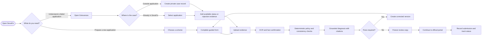
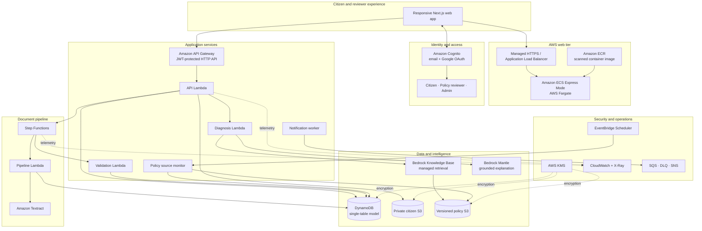
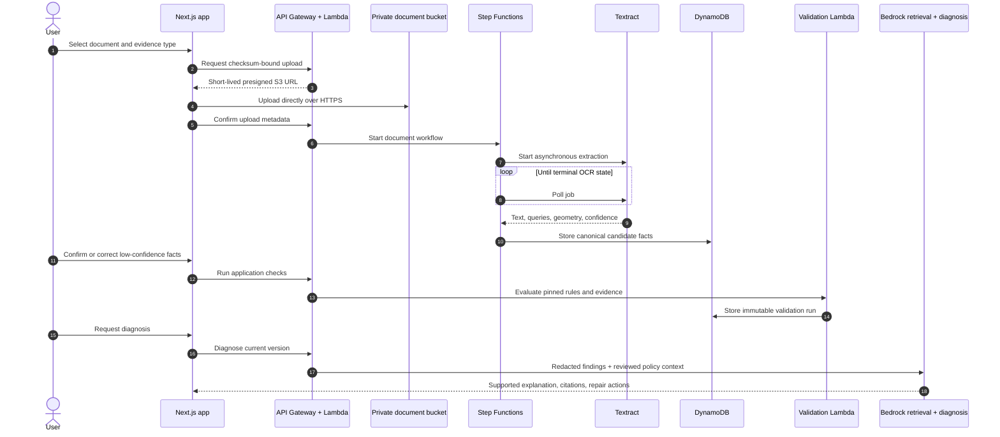
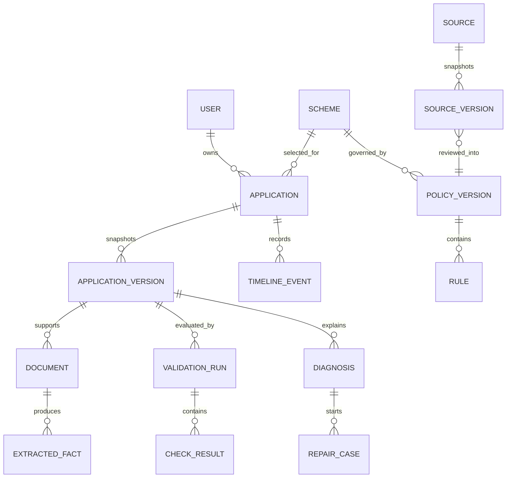
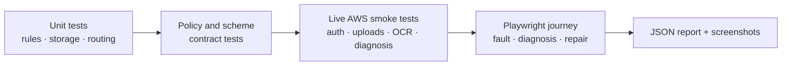

<div align="center">

# SevaFix

### Evidence-first guidance for government benefit applications

SevaFix helps people prepare an application correctly, understand a failed application,
and create a traceable corrected version—without pretending to be the government authority.

[**Open the live application →**](https://se-336f1f086653422a93c5d50efec9bd01.ecs.ap-south-1.on.aws)
&nbsp;&nbsp;·&nbsp;&nbsp;
[Architecture](#architecture)
&nbsp;&nbsp;·&nbsp;&nbsp;
[Quick start](#quick-start)
&nbsp;&nbsp;·&nbsp;&nbsp;
[Run the demo](#run-the-complete-demo)

<br />

[](https://se-336f1f086653422a93c5d50efec9bd01.ecs.ap-south-1.on.aws)


</div>

> [!IMPORTANT]
> SevaFix is an application-preparation and evidence-diagnosis tool. It does not submit government applications automatically, make eligibility decisions, or replace an official scheme portal.

---

## What SevaFix solves

Government benefit applications often fail for ordinary, fixable reasons: a value differs between the form and a certificate, a required document is missing, a document is stale, or a policy rule was misunderstood. Applicants may receive a vague status—or no useful rejection reason at all.

SevaFix turns that uncertainty into a structured workflow:

| Capability | What the user gets |
|---|---|
| **Prepare from scratch** | Scheme discovery, guided form entry, evidence upload, policy checks, and a submission-ready review |
| **Diagnose a grievance** | A diagnosis from the application record and documents—even when no official rejection message is available |
| **Repair safely** | A new corrected version linked to the original; historical versions remain immutable |
| **Track manually submitted cases** | A dated timeline for official portal IDs, status changes, notes, and supporting evidence |
| **Keep policy evidence reviewable** | Versioned sources, deterministic rules, reviewer approval, citations, and rollbackable active pointers |

### Product principles

- **Evidence before explanation.** Documents and reviewed policy claims are the basis of every diagnosis.
- **Rules decide; AI explains.** Deterministic checks produce pass/fail/review states. The model explains supported findings in plain language.
- **No rejection letter required.** A user can provide one, but SevaFix can diagnose inconsistencies from the application, evidence, and policy alone.
- **Corrections never rewrite history.** Repair creates a new version instead of mutating the frozen record.
- **Clear authority boundary.** Every readiness result is labelled as a SevaFix preparation check—not a government decision.

---

## User journeys



The two entry points remain separate in the interface, but converge on the same evidence, validation, diagnosis, repair, and tracking system.

---

## Architecture

SevaFix uses a containerized Next.js frontend and an event-driven AWS backend. The synchronous API remains small; document extraction and validation run asynchronously.



### AWS service map

| Concern | AWS service | Responsibility |
|---|---|---|
| Web hosting | ECS Express Mode, Fargate, ALB, ECR | Runs the production Next.js container behind managed HTTPS |
| Identity | Cognito User Pools | Email/password, Google federation, recovery, optional TOTP MFA, JWTs, and role groups |
| API | API Gateway + Lambda | Authenticated citizen/reviewer routes and ownership enforcement |
| Workflow | Step Functions | Durable OCR polling and post-extraction validation |
| Documents | S3 + Textract | Private uploads, short-lived view URLs, OCR, and extracted facts |
| Operational data | DynamoDB | Applications, versions, documents, checks, diagnoses, timelines, policies, and audits |
| Policy intelligence | Bedrock Knowledge Bases | Retrieval over reviewed, versioned policy material |
| Explanation | Bedrock Mantle | Citation-constrained diagnosis after deterministic checks |
| Messaging | SQS, DLQ, SNS | Retryable notification processing |
| Monitoring | CloudWatch + X-Ray | Logs, traces, API access records, workflow errors, and alarms |
| Encryption | KMS | Customer-managed encryption for application data and documents |

<details>
<summary><strong>Why not let the language model decide everything?</strong></summary>

| Deterministic layer | AI layer |
|---|---|
| Compares typed form values and confirmed document facts | Converts supported failures into understandable guidance |
| Executes version-pinned policy operators | Retrieves relevant reviewed policy passages |
| Produces `PASS`, `FAIL`, `REVIEW`, or `BLOCKED` | Cites evidence and clearly labels inference |
| Remains repeatable and testable | Handles ambiguity and natural-language explanation |
| Fails closed when evidence is incomplete | Cannot override rules or claim an authority decision |

This split keeps validation auditable while still making the outcome useful to a citizen.

</details>

---

## Document and diagnosis pipeline



Uploaded files never pass through the browser application server. The API issues a short-lived, checksum-aware S3 upload contract; the browser uploads directly to the private bucket.

---

## Data model

SevaFix uses one on-demand DynamoDB table per environment with `PK`/`SK` keys and three GSIs. Large documents, OCR payloads, and policy artifacts stay in S3; DynamoDB stores their coordinates, hashes, state, and searchable metadata.



<details>
<summary><strong>Core DynamoDB key patterns</strong></summary>

| Record | Partition key | Sort key |
|---|---|---|
| User profile | `USER#<sub>` | `PROFILE` |
| User application listing | `USER#<sub>` | `APP#<createdAt>#<appId>` |
| Application metadata | `APP#<appId>` | `META` |
| Immutable version | `APP#<appId>` | `VER#<number>` |
| Document | `APP#<appId>` | `DOC#<documentId>` |
| Extracted fact | `APP#<appId>` | `FACT#<version>#<factId>` |
| Validation run | `APP#<appId>` | `RUN#<runId>` |
| Check result | `APP#<appId>` | `CHECK#<runId>#<ruleId>` |
| Timeline event | `APP#<appId>` | `EVENT#<timestamp>#<id>` |
| Repair case | `APP#<appId>` | `REPAIR#<repairId>` |
| Scheme | `SCHEME#<schemeId>` | `META` |
| Policy version | `SCHEME#<schemeId>` | `POLICY#<effectiveFrom>#<versionId>` |

See [the full AWS blueprint](SEVAFIX_AWS_BLUEPRINT.md#10-database-and-object-model) for access patterns, indexes, S3 layout, retention, and deletion semantics.

</details>

---

## Repository structure

```text
AWS-Tangled/
├── frontend/                         # Next.js citizen + reviewer application
│   ├── src/app/                      # App Router pages and health endpoint
│   ├── src/components/               # Shells, navigation, UI, lab visualizations
│   ├── src/lib/sevafix/              # API client, auth, schemas, upload helpers
│   ├── scripts/                      # Browser smoke tests and full mock run
│   └── Dockerfile                    # Multi-stage production container
├── backend/                          # AWS SAM serverless backend
│   ├── src/api/                      # Authenticated HTTP API
│   ├── src/pipeline/                 # Textract document worker
│   ├── src/validation/               # Deterministic rule engine entry point
│   ├── src/diagnosis/                # Grounded Bedrock diagnosis
│   ├── src/source_monitor/            # Official-source change detection
│   ├── src/deletion/                  # Account and personal-data deletion
│   ├── src/notification/              # SQS/DLQ/SNS worker
│   ├── src/common/                    # Storage, rules, settings, scheme packages
│   ├── data/                          # Reviewed PM-USP policy versions
│   ├── scripts/                       # Seed, deploy, verify, smoke, and mock tools
│   ├── tests/                         # 42 backend tests
│   └── template.yaml                  # Complete SAM/CloudFormation architecture
├── deployment/                        # ECS task/infrastructure trust policies
├── infra/bootstrap/                   # Least-privilege CLI deployment bootstrap
├── frontend-reference/                # OpenAPI contract and integration examples
├── artifacts/mock-run/README.md       # Generated demo evidence guide
├── output/DEMO_RUN_GUIDE.md           # Aarav Mehta live demo walkthrough
├── AWS_SETUP.md                       # Account, CLI, and stack setup
├── DATA_INGESTION_AND_ACCEPTANCE_REPORT.md
├── FRONTEND_HANDOFF.md
└── SEVAFIX_AWS_BLUEPRINT.md           # Product + technical design record
```

### Where should I start?

| If you are… | Start here |
|---|---|
| Evaluating the product | [Live application](https://se-336f1f086653422a93c5d50efec9bd01.ecs.ap-south-1.on.aws) → [demo guide](output/DEMO_RUN_GUIDE.md) |
| Building the frontend | [`frontend/README.md`](frontend/README.md) → [`frontend/src/app`](frontend/src/app) |
| Working on APIs or data | [`backend/README.md`](backend/README.md) → [`backend/src/api/app.py`](backend/src/api/app.py) |
| Reviewing architecture | [`SEVAFIX_AWS_BLUEPRINT.md`](SEVAFIX_AWS_BLUEPRINT.md) |
| Auditing scheme data | [`DATA_INGESTION_AND_ACCEPTANCE_REPORT.md`](DATA_INGESTION_AND_ACCEPTANCE_REPORT.md) |
| Deploying another environment | [`AWS_SETUP.md`](AWS_SETUP.md) → [`infra/bootstrap`](infra/bootstrap) |

---

## Current verified deployment

| Item | State |
|---|---|
| Live web application | [Open SevaFix](https://se-336f1f086653422a93c5d50efec9bd01.ecs.ap-south-1.on.aws) |
| Frontend | ECS Express Mode, 1 healthy Fargate task, managed HTTPS |
| Backend stack | `sevafix-dev` in `ap-south-1` |
| API | API Gateway HTTP API + seven Python 3.12 Lambda functions |
| Authentication | Cognito email/password and Google OAuth |
| Knowledge base | Managed Bedrock Knowledge Base in `ap-northeast-1` |
| Catalog | 10 government schemes; PM-USP has the deepest executable demo policy |
| Container security | ECR scan completed with no findings at deployment time |
| Verification snapshot | 20 September 2026 |

### Acceptance results

```text
Backend test suite             42 passed
Frontend lint                  passed
Next.js production build      passed
ECS rolling deployment        completed
HTTPS health endpoint         200 OK
API Gateway CORS              verified
S3 direct-upload CORS         verified
Cognito + Google redirect     verified
Full deployed browser flow    passed
```

The deployed Aarav Mehta scenario intentionally uploads an incorrect income certificate, detects the mismatch, produces a grounded diagnosis, replaces the evidence, and reruns the checks:

```text
Faulty version       12 passed · 1 failed · 0 review · 0 blocked
Corrected version    13 passed · 0 failed · 0 review · 0 blocked
```

<details>
<summary><strong>Scheme catalog currently seeded</strong></summary>

1. Ayushman Bharat Pradhan Mantri Jan Arogya Yojana
2. National Social Assistance Programme
3. Pradhan Mantri Kisan Samman Nidhi
4. Prime Minister Street Vendor's AtmaNirbhar Nidhi
5. PM-USP Central Sector Scheme of Scholarship for College and University Students
6. PM Vishwakarma
7. Pradhan Mantri Awaas Yojana - Gramin
8. Pradhan Mantri Awas Yojana - Urban 2.0
9. Pradhan Mantri Matru Vandana Yojana
10. Pradhan Mantri Ujjwala Yojana

Catalog presence does not imply equivalent rule depth. Policy manifests explicitly describe each scheme's activation and verification state.

</details>

---

## Quick start

### Prerequisites

- Node.js 20 or newer and npm
- Python 3.12
- AWS CLI v2 and AWS SAM CLI
- A deployed SevaFix backend, or permission to deploy one
- Docker Desktop only when building the production frontend container

### 1. Configure the frontend

```powershell
cd frontend
Copy-Item .env.example .env.local
npm install
npm run dev
```

Open [http://localhost:3000](http://localhost:3000). Populate `.env.local` from the backend CloudFormation outputs.

<details>
<summary><strong>Frontend environment variables</strong></summary>

| Variable | Purpose |
|---|---|
| `NEXT_PUBLIC_AWS_REGION` | Cognito and API region |
| `NEXT_PUBLIC_COGNITO_USER_POOL_ID` | Cognito user pool |
| `NEXT_PUBLIC_COGNITO_USER_POOL_CLIENT_ID` | Public browser app client |
| `NEXT_PUBLIC_SEVAFIX_API_URL` | API Gateway stage URL, without trailing slash |
| `NEXT_PUBLIC_COGNITO_OAUTH_DOMAIN` | Cognito hosted-UI domain used for Google login |
| `NEXT_PUBLIC_COGNITO_OAUTH_REDIRECT` | Exact local or deployed callback URL |

All variables are public browser configuration—not AWS credentials. Never place secrets in a `NEXT_PUBLIC_*` value.

</details>

### 2. Prepare and test the backend

```powershell
cd backend
python -m venv .venv
.\.venv\Scripts\Activate.ps1
python -m pip install -r requirements-dev.txt
python -m pytest -q
sam validate --template-file template.yaml --lint
sam build
```

### 3. Deploy the backend

```powershell
sam deploy --config-env dev
```

The development stack parameters live in [`backend/samconfig.toml`](backend/samconfig.toml). Google secrets and data.gov.in keys are entered through the provided deployment scripts and must never be committed.

Read [`AWS_SETUP.md`](AWS_SETUP.md) and [`backend/README.md`](backend/README.md) before deploying into another account or changing regions.

### 4. Read deployed outputs

```powershell
aws cloudformation describe-stacks `
  --stack-name sevafix-dev `
  --profile sevafix-deploy `
  --region ap-south-1 `
  --query "Stacks[0].Outputs" `
  --output table
```

---

## Run the complete demo

The full workflow runner creates a disposable Cognito citizen, generates the mock documents, uses the real deployed backend, captures browser evidence, and cleans the account up in a `finally` block.

### Against a local production build

```powershell
python frontend\scripts\run_full_mock.py
```

### Against the deployed website

```powershell
python frontend\scripts\run_full_mock.py `
  https://se-336f1f086653422a93c5d50efec9bd01.ecs.ap-south-1.on.aws
```

For the manual stage presentation—including every PM-USP form value and which certificate to upload—follow [`output/DEMO_RUN_GUIDE.md`](output/DEMO_RUN_GUIDE.md).

---

## API surface

All citizen routes except `/health` require a Cognito access token. Every application operation verifies ownership server-side. Reviewer routes additionally require the `policy-reviewer` or `admin` group.

<details>
<summary><strong>Citizen API groups</strong></summary>

- **Profile:** `/me`, account updates, and `/me/deletion`
- **Discovery:** `/schemes`, `/schemes/{schemeId}`
- **Applications:** create, list, load, update draft, freeze version
- **Grievances:** create from an owned or outside application record
- **Documents:** presigned upload, completion, view URL, fact confirmation, deletion
- **Checks:** validation runs and individual results
- **Submission:** official portal handoff record and external status timeline
- **Diagnosis:** grounded diagnosis and cited findings
- **Repair:** clone a frozen version into a corrected editable version
- **Jobs:** asynchronous workflow status

</details>

<details>
<summary><strong>Reviewer API groups</strong></summary>

- Review detected official-source changes
- Approve or reject source snapshots
- Publish reviewed policy versions and rule sets
- Roll back the active policy pointer without deleting history
- Record audit reasons for every policy-changing action

The complete integration contract is available in [`frontend-reference/openapi.yaml`](frontend-reference/openapi.yaml).

</details>

---

## Security, privacy, and responsible AI

| Boundary | Implementation |
|---|---|
| Authentication | Cognito SRP/password auth, Google federation, verified-email recovery, token revocation, optional TOTP MFA |
| Authorization | JWT authorizer, citizen/reviewer/admin groups, and per-record ownership checks |
| Storage | Private S3, public-access blocking, object versioning, HTTPS-only bucket policies |
| Encryption | KMS encryption for DynamoDB and S3; key rotation enabled |
| Upload safety | Declared type/size, checksum validation, opaque object keys, expiring SigV4 URLs |
| Data recovery | DynamoDB point-in-time recovery and retained data resources |
| Privacy | PII redaction before model calls; opaque document keys; no names, emails, or official application IDs in keys or metrics |
| AI grounding | Reviewed policy retrieval, evidence citations, `store: false`, deterministic fail-closed fallback |
| Auditability | Immutable application versions, validation runs, policy versions, source hashes, and timelines |
| Deletion | Dedicated worker removes Cognito identity, table records, and versioned personal objects |

> [!WARNING]
> Never commit access keys, OAuth secrets, API keys, tokens, OTPs, real citizen documents, or unredacted production exports. Local environment files and generated evidence are ignored by Git.

Optional GuardDuty Malware Protection is defined in the SAM template but disabled in the development stack to avoid unapproved per-object scanning charges.

---

## Testing strategy



```powershell
# Backend
cd backend
python -m pytest -q

# Frontend
cd ..\frontend
npm run lint
npm run build

# Full live UI flow
npm run test:live
```

Tests use synthetic identities and disposable accounts. The cleanup path runs even when a smoke-test stage fails.

---

## Operations and cost posture

- DynamoDB uses on-demand capacity; Lambda, API Gateway, Textract, Step Functions, and Bedrock are usage-based.
- The frontend keeps at least one ECS/Fargate task and an Application Load Balancer running, so it has an ongoing baseline cost.
- S3 lifecycle rules abort incomplete uploads and expire noncurrent citizen-document versions.
- CloudWatch log groups use bounded retention where configured.
- Expensive optional services—such as GuardDuty object scanning—remain feature-gated.

Use AWS Budgets and billing alarms before public traffic or large document batches. See [the blueprint's cost controls](SEVAFIX_AWS_BLUEPRINT.md#18-cost-and-scaling-controls) for the complete checklist.

---

## Troubleshooting

<details>
<summary><strong>Google login returns to an error page</strong></summary>

The browser origin must appear in both Cognito callback/logout URLs and `NEXT_PUBLIC_COGNITO_OAUTH_REDIRECT`. Google itself redirects to Cognito's `/oauth2/idpresponse`; Cognito then returns the user to SevaFix.

</details>

<details>
<summary><strong>API calls work in a terminal but fail in the browser</strong></summary>

Redeploy `AllowedOrigins` with the exact frontend origin, including `https://` and excluding a trailing slash. Both API Gateway and the citizen-document bucket enforce origin rules.

</details>

<details>
<summary><strong>A document remains in processing</strong></summary>

Inspect the Step Functions execution, the document-pipeline Lambda log group, and the Textract job state. Unsupported or low-confidence extraction is intentionally routed to confirmation/manual-entry states rather than silently accepted.

</details>

<details>
<summary><strong>Bedrock model access is blocked</strong></summary>

SevaFix separates managed Knowledge Base retrieval from generative diagnosis. Confirm the configured regions, knowledge-base ID/data-source ID, model identifier, and the deployment role's Bedrock permissions. Deterministic validation remains usable if generative explanation is unavailable.

</details>

---

## Documentation index

| Document | Purpose |
|---|---|
| [`SEVAFIX_AWS_BLUEPRINT.md`](SEVAFIX_AWS_BLUEPRINT.md) | Product decisions, workflows, architecture, data model, APIs, privacy, cost, and risk register |
| [`DATA_INGESTION_AND_ACCEPTANCE_REPORT.md`](DATA_INGESTION_AND_ACCEPTANCE_REPORT.md) | Source provenance, loaded data, and acceptance evidence |
| [`AWS_SETUP.md`](AWS_SETUP.md) | AWS CLI, account, stack, and permission setup |
| [`backend/README.md`](backend/README.md) | Backend resources, routes, deployment, seeding, and live smoke tests |
| [`frontend/README.md`](frontend/README.md) | Frontend configuration and browser verification |
| [`FRONTEND_HANDOFF.md`](FRONTEND_HANDOFF.md) | API and UX handoff reference |
| [`output/DEMO_RUN_GUIDE.md`](output/DEMO_RUN_GUIDE.md) | Step-by-step PM-USP demonstration |

---

## Contributing

1. Create a focused branch.
2. Keep policy claims tied to official sources and immutable versions.
3. Add or update deterministic tests for rule changes.
4. Run backend tests, frontend lint, and the production build.
5. Never include real citizen data or credentials in fixtures, screenshots, logs, or commits.

When changing infrastructure, inspect the CloudFormation change set for replacements before deployment. Data resources use retention protections, but a careless policy or migration can still create operational risk.

---

<div align="center">

**SevaFix makes application failures understandable, correctable, and auditable.**

Built for AWS Bharat Builds · Designed around citizen clarity and responsible automation

</div>
