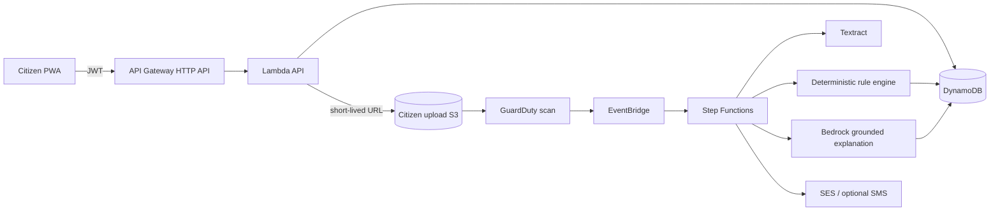
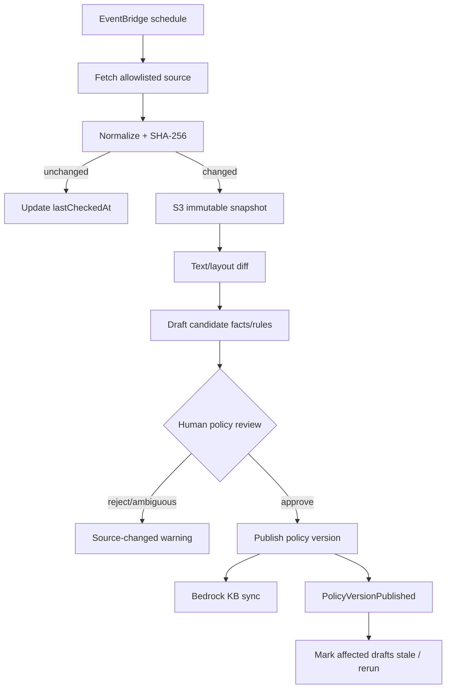

# SevaFix — AWS Product and Technical Blueprint

> Living architecture document derived from `SevaFix — Government Application Companion (First Commit by AWS).pdf` and supporting research. This document is intended to be implementation-ready for the AWS Bharat Builds Tour.

**Document status:** Architecture draft complete; research baseline 19 September 2026. Service availability, scheme windows and legal obligations must be rechecked immediately before launch.

## 1. Executive summary

SevaFix is a citizen-side companion for Indian government-benefit applications. It occupies the gap between discovering a scheme and receiving a decision from the responsible government authority:

1. **Prepare:** collect scheme-specific answers and documents, extract their contents, and run explainable consistency and policy checks before submission.
2. **Track:** preserve the application ID, user-supplied or legally accessible status changes, supporting documents, and grievance events in one timeline.
3. **Repair:** interpret a rejection/return notice against dated official sources, point to the likely failed field or document, and create a corrected application version without erasing history.

SevaFix does **not** decide eligibility, approve applications, replace myScheme or an official portal, bypass OTP/CAPTCHA/login, or automate submission without an explicitly permitted public API. “Ready” means that all checks implemented by SevaFix passed; it is never a promise of approval.

## 2. Product decisions and scope

### 2.1 Core design principles

- **Evidence before explanation:** every material rule and every rejection diagnosis must link to an official source, source version, retrieval time, and relevant page/section where available.
- **Rules decide; AI explains:** deterministic code evaluates structured requirements. Generative AI may classify, retrieve, summarize, translate, and explain evidence but must not invent or silently modify eligibility rules.
- **Time-aware evaluation:** validate against the rule version effective on the intended/submitted application date, not merely the latest version.
- **Human review on policy changes:** a changed source creates a candidate policy version. It does not automatically become an active executable rule when extraction is ambiguous.
- **Data minimization:** store only fields needed for supported workflows; use short retention for raw sensitive uploads; make deletion understandable and enforceable.
- **Honest integration:** use public/authorized APIs where available; otherwise accept a manual status update or user-uploaded screenshot/PDF/SMS.
- **Small but complete MVP:** implement one scheme deeply, with a reusable scheme adapter, rather than claiming nationwide scheme coverage.

### 2.2 Recommended hackathon boundary

The MVP should support **one scheme, one primary language plus English, PDF/JPEG/PNG uploads, four to eight deterministic checks, manual application-ID capture, user-uploaded status/rejection evidence, and one repair/versioning loop**. A second scheme is a stretch goal only after the complete first journey works.

The supported scheme should be selected using these gates:

- official rules and application instructions are publicly accessible and stable enough for a demo;
- sample or safely synthetic documents can demonstrate mismatches without using real citizen PII;
- at least four meaningful rules can be represented deterministically;
- the official application and grievance routes are linkable;
- no scraping behind authentication, CAPTCHA, or terms that prohibit automation is needed.

## 3. System context

```text
Citizen / assisted-service operator
            |
      Web/mobile UI
            |
 Amazon CloudFront + AWS WAF
            |
     API Gateway (HTTP API)
            |
  Cognito authorizer + Lambda API
            |
  +---------+-------------+------------------+
  |                       |                  |
DynamoDB             S3 document vault   Step Functions
profiles/apps/       uploads/evidence/    async workflows
rules/timeline       policy snapshots          |
  |                       |             Textract / Bedrock
  +----------- EventBridge + SQS/SNS ----------+
                          |
              official public sources
```

## 4. Major bounded contexts

| Context | Responsibility | Must not do |
|---|---|---|
| Identity and consent | Sign-up/sign-in, sessions, verified contact points, consent receipts, account deletion | Reuse government credentials or collect portal passwords |
| Scheme catalog | Supported scheme metadata, field definitions, document checklist, official links | Pretend to be a complete scheme-discovery replacement |
| Source registry | Allowlisted official URLs, snapshots, hashes, effective dates, review state | Treat arbitrary search results as authoritative |
| Application workspace | Draft data, immutable versions, document associations, readiness summary | Mutate an already submitted/versioned record in place |
| Document intelligence | Upload validation, malware screening, OCR, field normalization, confidence handling | Treat low-confidence OCR as fact |
| Rules and validation | Versioned executable rules and deterministic check results | Ask an LLM to make final eligibility decisions |
| Tracking | Manual/authorized status ingestion and append-only event timeline | Circumvent protected government status systems |
| Diagnosis and repair | Grounded rejection classification, cited explanation, correction plan, new version creation | Claim the inferred reason is an official decision |
| Notifications | Opt-in action reminders and processing completion alerts | Put sensitive values or document links in SMS/email |
| Operations and governance | Audit trail, observability, security controls, retention/deletion, policy review | Log raw PII or extracted document text indiscriminately |

## 5. AWS architecture

### 5.1 Deployment shape

Use **Asia Pacific (Mumbai), `ap-south-1`**, for the application, uploads, metadata, OCR and audit data. Textract, Bedrock endpoints, Titan Text Embeddings V2 and S3 Vectors are available in Mumbai, but individual Bedrock generation models have different in-Region/cross-Region behavior. Pin the chosen model and inference profile in configuration and complete a data-residency review before sending any personal data. The preferred design sends Bedrock redacted facts and official policy excerpts, not raw citizen documents.

Deploy separate `dev`, `staging` and `prod` AWS accounts. For the hackathon, separate CloudFormation stacks in one account are acceptable, but each environment must use distinct buckets, tables, Cognito pools, keys and log groups.

### 5.2 Service map

| Need | AWS service | Design choice |
|---|---|---|
| Web application | AWS Amplify Hosting or S3 + CloudFront | Next.js/React PWA; CloudFront TLS; no sensitive document caching |
| Edge protection | AWS WAF | Managed rules, rate limits and bot controls on CloudFront/API |
| Authentication | Amazon Cognito User Pools | Citizen accounts, verified email, JWTs, reviewer/admin groups |
| API | Amazon API Gateway HTTP API | Cognito JWT authorizer, OAuth scopes, throttling and request limits |
| Backend compute | AWS Lambda | Small domain-oriented handlers; no single monolithic function |
| Durable orchestration | AWS Step Functions Standard | Document processing, validation, source refresh, diagnosis and deletion workflows |
| Operational queues | Amazon SQS + DLQs | Backpressure, retries and isolation around OCR, notifications and source ingestion |
| Metadata database | Amazon DynamoDB | Serverless operational data, immutable versions, conditional writes and transactions |
| Binary/object storage | Amazon S3 | Separate private citizen-document, official-source and audit/export buckets |
| Encryption | AWS KMS | Separate customer-managed keys for citizen content, policy content and logs |
| Malware scanning | GuardDuty Malware Protection for S3 | Scan new uploads; release only clean objects for processing |
| OCR/document structure | Amazon Textract | Async text/forms/tables/queries for supported-language PDFs and images |
| Grounded explanation | Amazon Bedrock Knowledge Bases | Retrieve only reviewed official policy versions using metadata filters |
| Vector store | Amazon S3 Vectors | Cost-oriented MVP vector store; move to OpenSearch Serverless only if low-latency/high-QPS needs justify it |
| Embeddings | Amazon Titan Text Embeddings V2 | Available in Mumbai; dimension is fixed when the index is created |
| Generated explanation | Amazon Bedrock model via Converse/RetrieveAndGenerate | Produces constrained structured explanations, never the authoritative check outcome |
| AI safety | Amazon Bedrock Guardrails | Sensitive-information filters, denied topics and contextual-grounding checks |
| Translation | Amazon Translate | Optional display translation after extraction; retain and cite the original authoritative text |
| Scheduling/events | Amazon EventBridge Scheduler + EventBridge | Source checks, domain events and workflow completion routing |
| Notifications | Amazon SES; SNS/AWS End User Messaging SMS later | Email for MVP; opt-in SMS only after Indian DLT registration |
| Secrets/config | AWS Secrets Manager + Systems Manager Parameter Store | Connector secrets versus non-secret environment configuration |
| Monitoring/audit | CloudWatch, X-Ray, CloudTrail, AWS Config | Metrics, traces, alarms, infrastructure/API audit and drift evidence |
| Security posture | GuardDuty, Security Hub, IAM Access Analyzer | Threat detection and misconfiguration findings |
| PII discovery | Amazon Macie (production option) | Periodic detection of unexpected PII in S3; not required for the demo |

GuardDuty Malware Protection can scan newly uploaded S3 objects and publishes results to EventBridge; S3 tags can carry scan status. Processing roles must be denied `GetObject` unless `GuardDutyMalwareScanStatus=NO_THREATS_FOUND`. See [GuardDuty Malware Protection for S3](https://docs.aws.amazon.com/guardduty/latest/ug/gdu-malware-protection-s3.html).

### 5.3 Synchronous and asynchronous paths

The synchronous path handles small user actions: validate JWT, authorize ownership, read/update DynamoDB and return a job identifier. Upload, OCR, full validation, policy ingestion and diagnosis are asynchronous so the UI never waits on Textract or Bedrock.



S3 notifications are at-least-once and may be duplicated or out of order, so every consumer must be idempotent and compare the S3 event `sequencer`/stored processing version before changing state. See [S3 event ordering and duplicate behavior](https://docs.aws.amazon.com/AmazonS3/latest/userguide/notification-how-to-event-types-and-destinations.html).

### 5.4 Deliberate non-choices

- No EC2/EKS for the MVP; there is no long-running workload that justifies cluster operations.
- No relational database initially; access patterns are entity/version/timeline oriented. Add Aurora PostgreSQL only if later reporting or cross-scheme relational queries become dominant.
- No Amazon Bedrock Agent with broad tool access. Explicit Step Functions workflows are easier to audit and constrain.
- No scraping engine that signs into government portals. Only allowlisted public pages/APIs are candidates, subject to terms and robots/policy review.
- No citizen-document content in the policy knowledge base.

## 6. Identity, login and authorization

### 6.1 MVP sign-in

Use a Cognito User Pool and a custom accessible sign-in UI. The recommended MVP method is **email one-time password**; it minimizes password friction and avoids Indian SMS registration during the hackathon. If the selected Cognito tier/configuration does not support the desired passwordless custom flow, fall back to email + password with email verification. Cognito supports passwordless email/SMS OTP in custom SDK flows, while managed-login behavior and feature-plan support must be checked when configuring the pool. See [Cognito passwordless authentication](https://docs.aws.amazon.com/cognito/latest/developerguide/amazon-cognito-user-pools-authentication-flow-methods.html) and [feature plans](https://docs.aws.amazon.com/cognito/latest/developerguide/cognito-sign-in-feature-plans.html).

Phone OTP is a post-MVP option. Transactional messaging in India requires TRAI/DLT setup, registered templates/entity identifiers, and a registered sender ID; local routes are supported from Mumbai and Hyderabad. See [India sender-ID registration](https://docs.aws.amazon.com/sms-voice/latest/userguide/registrations-sms-senderid-india-support.html).

Do not use Aadhaar as the SevaFix login identifier, do not perform Aadhaar authentication, and never ask for an official-portal password or OTP.

### 6.2 Authentication flow

1. User enters email and accepts the privacy notice/terms.
2. Frontend starts the Cognito authentication challenge.
3. User enters the one-time code; Cognito verifies it and returns ID, access and refresh tokens.
4. Frontend keeps tokens in secure, same-site, HTTP-only cookies through a backend-for-frontend where practical; never put tokens in URLs or localStorage.
5. API Gateway validates the access-token signature, issuer, audience/client ID, expiry and required OAuth scope. AWS recommends scopes to distinguish access tokens from other JWTs; see [API Gateway JWT authorizers](https://docs.aws.amazon.com/apigateway/latest/developerguide/http-api-jwt-authorizer.html).
6. Lambda derives the user ID only from the validated `sub` claim. It never trusts a user ID in a path/body for authorization.

### 6.3 Roles and scopes

| Principal | Cognito group/scope | Permissions |
|---|---|---|
| Citizen | `citizen`, `sevafix/app.read`, `sevafix/app.write` | Own profile, applications, documents and timeline only |
| Assisted operator (future) | `operator` plus explicit delegation record | Only a consenting citizen’s named application for a bounded period |
| Policy reviewer | `policy-reviewer`, `sevafix/policy.review` | Source candidates, diffs, rule drafts and publish/reject actions |
| Administrator | `admin` | Configuration and support actions; document access is not implicit |
| Machine workflow | IAM role, no Cognito account | Least-privilege access to its exact table keys, prefixes and APIs |

Every object/data read repeats server-side ownership checks. Admin support access is just-in-time, reason-coded and audited. A user-pool group must never by itself grant blanket access to citizen documents.

### 6.4 Account recovery and deletion

- Recovery uses the verified email flow managed by Cognito.
- Changing email requires re-verification; sensitive actions require recent authentication.
- “Delete my data” creates a deletion job, immediately blocks the account from new activity, deletes/revokes documents and derived citizen data, records only the minimum non-PII tombstone needed to make retries idempotent, and then deletes/disables the Cognito user.
- Legal/security audit retention is handled separately from product data and documented in the privacy notice.

## 7. Document upload, viewing and parsing

### 7.1 Upload contract

1. `POST /documents/uploads` receives application/version, declared document type, MIME type, size and SHA-256 checksum.
2. Backend verifies application ownership, allowlisted types, per-file/user quotas and that the version is editable.
3. It creates a `PENDING_UPLOAD` record and returns a 5-minute presigned S3 `PUT` URL for a server-generated, non-guessable key. Presigned URLs are bearer capabilities and can be reused until expiry, so keep them short-lived and bind checksum/content type/size policy. AWS documents presigned upload/download behavior [here](https://docs.aws.amazon.com/AmazonS3/latest/userguide/using-presigned-url.html).
4. Client uploads directly to S3 with the checksum and SSE-KMS headers required by bucket policy.
5. Client calls `POST /documents/{id}/complete`; backend performs `HeadObject` and checks key, size, checksum, content type and ownership metadata.
6. Malware scan result moves the record to `SCAN_CLEAN` or `QUARANTINED`.
7. A clean object starts `DocumentProcessingStateMachine`; quarantined content is never passed to Textract and is not downloadable by the citizen until safely deleted/replaced.

Use S3 Block Public Access, Bucket Owner Enforced object ownership (ACLs disabled), versioning, TLS-only bucket policies and separate KMS keys. AWS documents Bucket Owner Enforced behavior [here](https://docs.aws.amazon.com/AmazonS3/latest/userguide/about-object-ownership.html).

### 7.2 Processing state machine

```text
PENDING_UPLOAD -> UPLOADED -> SCANNING -> SCAN_CLEAN
     -> OCR_QUEUED -> OCR_RUNNING -> EXTRACTED
     -> NORMALIZED -> NEEDS_USER_CONFIRMATION | READY_FOR_VALIDATION

Terminal/exception states:
UPLOAD_EXPIRED, QUARANTINED, UNSUPPORTED_FORMAT, UNSUPPORTED_LANGUAGE,
OCR_FAILED_RETRYABLE, OCR_FAILED_FINAL, DELETED
```

The state machine:

1. identifies real file type from magic bytes, rejects encrypted/password-protected PDFs and enforces demo limits (for example 10 MB and 20 pages, deliberately below service maxima);
2. creates a Textract async job with a deterministic client token;
3. stores raw Textract JSON in an encrypted S3 derived-data prefix, not DynamoDB;
4. maps blocks/queries to a scheme-specific canonical field schema;
5. normalizes whitespace, dates, currency and identifiers while preserving original text and bounding boxes;
6. masks full Aadhaar values and bank account numbers in UI/log representations;
7. sends low-confidence or conflicting fields to user confirmation;
8. emits `DocumentFactsReady` and reruns affected checks only.

Textract supports JPEG, PNG, PDF and TIFF and async PDF/TIFF jobs up to 500 MB/3,000 pages, though SevaFix should impose much smaller product limits. See [Textract quotas](https://docs.aws.amazon.com/textract/latest/dg/limits-document.html).

### 7.3 Critical language limitation

As of the research baseline, Textract text detection supports English, French, German, Italian, Portuguese and Spanish; Queries and handwriting are English-only. It does **not** provide Hindi or other Indic-script OCR. This is a product constraint, not a prompt problem. See [Textract supported languages](https://docs.aws.amazon.com/textract/latest/dg/limits-document.html) and [Textract FAQ](https://aws.amazon.com/textract/faqs/).

Therefore:

- MVP documents must be English or bilingual with the needed values available in supported Latin text/numerals.
- Detect likely unsupported script before accepting OCR results; return `UNSUPPORTED_LANGUAGE` with a manual-entry/review route.
- Amazon Translate can translate extracted Hindi text if another compliant OCR source produced it, but Translate cannot read a Hindi image. Translate supports Hindi, Bengali, Gujarati, Kannada, Malayalam, Marathi, Punjabi, Tamil, Telugu and Urdu among other languages; see [supported languages](https://docs.aws.amazon.com/translate/latest/dg/what-is-languages.html).
- Do not silently use a vision LLM as authoritative OCR for high-stakes fields. A future Indic OCR adapter/provider must be benchmarked, contractually approved and placed behind the same `DocumentExtractor` interface with human confirmation.

### 7.4 Confidence policy

Store confidence per extracted field, not only per document. Initial thresholds must be tuned on a labelled scheme-specific test set:

| Field class | Auto-use starting threshold | Below threshold |
|---|---:|---|
| Full name/address | 95 | User confirms highlighted source region |
| Income/marks/date of birth/year | 98 | Mandatory confirmation; check cannot pass yet |
| Bank/Aadhaar-like identifiers | Never auto-display full value | Mask; compare only normalized/hashed representation where possible |
| Non-decisive description text | 90 | Mark uncertain or omit |

Textract confidence scores run from 0–100 and AWS advises higher thresholds/human scrutiny for sensitive false-positive use cases. See [Textract best practices](https://docs.aws.amazon.com/textract/latest/dg/textract-best-practices.html). A high OCR confidence is not proof that the document is genuine.

### 7.5 Viewing documents

`POST /documents/{id}/view-url` verifies the JWT, application ownership, document state and purpose, writes an audit event, and returns a one- to five-minute presigned `GET` URL with `Content-Disposition: inline`. The raw S3 key is never accepted from the client. Disable CloudFront caching for citizen documents, prevent browser indexing, and use restrictive CSP/referrer policies. Reviewers see policy sources through a separate bucket/domain; ordinary policy citations can link to the canonical official URL plus the preserved snapshot.

## 8. Official source and policy pipeline

### 8.1 Source policy

Trust sources in this order, subject to scheme-specific legal relevance:

1. Official ministry/department notifications, circulars, guidelines and scheme documents.
2. Official scheme/department portals.
3. eGazette and India Code for controlling legal instruments.
4. myScheme for discovery summaries, document lists and official application links.
5. data.gov.in and DBT Bharat for applicable official datasets/metadata.
6. CPGRAMS for the official grievance route.

Every source record must include an owning authority, canonical URL, source type, retrieval timestamp, content hash, stored snapshot, publication/effective dates when known, parser status, reviewer state and supersession relationship.

myScheme is a discovery and guidance source, not always the controlling instrument. Its own description says it helps users discover schemes, check eligibility information and navigate to application pages; it currently redirects users to the concerned authority’s application page. See [myScheme About](https://www.myscheme.gov.in/about) and [myScheme FAQs](https://www.myscheme.gov.in/faqs).

### 8.2 Source Registry record

Each supported scheme starts with a manually approved allowlist:

```json
{
  "sourceId": "src_pmusp_guidelines_2025",
  "schemeId": "pm-usp-csss",
  "authority": "Ministry of Education, Department of Higher Education",
  "canonicalUrl": "https://...gov.in/...pdf",
  "hostAllowlist": ["education.gov.in"],
  "sourceType": "GUIDELINE_PDF",
  "trustRank": 1,
  "jurisdiction": "IN-CENTRAL",
  "retrievalMethod": "PUBLIC_HTTP",
  "checkCadence": "P1D",
  "reviewState": "ACTIVE",
  "lastCheckedAt": "2026-09-19T00:00:00Z"
}
```

Never let a user-provided URL enter the fetcher. Resolve DNS and redirects safely, deny private/link-local address ranges, limit bytes/time/redirects, require TLS, and keep the final host within the reviewed allowlist to prevent SSRF.

### 8.3 Change-detection and publishing workflow



Rules for this pipeline:

- Preserve the HTTP response metadata, SHA-256 and exact bytes for every changed version.
- A changed source never overwrites an old source or rule set.
- Publication is a DynamoDB transaction: add immutable policy version, set prior version’s `effectiveTo`, update scheme pointer and append audit event.
- If the effective date is unclear, reviewer must set `effectiveDateConfidence=UNKNOWN`; dependent checks become `NEEDS_REVIEW`, not fail/pass.
- If the source is unavailable or recently changed but unreviewed, show “Official source recently changed—verify before submission” and block only checks whose authority is uncertain.
- Robots/terms/licensing review is part of adding a source. Where automated retrieval is not permitted, use reviewer-uploaded official snapshots with a recorded provenance trail.

### 8.4 Knowledge-base ingestion

Only `PUBLISHED` source versions go into the knowledge-base S3 prefix. Each file has metadata such as `schemeId`, `policyVersionId`, `authority`, `sourceId`, `effectiveFrom`, `effectiveTo`, `language`, `trustRank` and `reviewState`. Bedrock Knowledge Bases supports S3 data sources, incremental sync and metadata files/filters; see [S3 knowledge-base data sources](https://docs.aws.amazon.com/bedrock/latest/userguide/kb-managed-ds-s3.html) and [metadata filtering](https://docs.aws.amazon.com/bedrock/latest/userguide/kb-managed-test-config.html).

Every retrieval must filter by:

- exact `schemeId`;
- `reviewState=PUBLISHED`;
- policy version selected for the application/submission date;
- permitted language(s);
- optionally the rule IDs implicated by deterministic validation.

S3 Vectors is appropriate for the small/infrequently queried MVP corpus and integrates with Bedrock Knowledge Bases in Mumbai. See [S3 Vectors integration](https://docs.aws.amazon.com/AmazonS3/latest/userguide/s3-vectors-getting-started.html) and [regional availability](https://docs.aws.amazon.com/AmazonS3/latest/userguide/s3-vectors-regions-quotas.html).

## 9. Validation, diagnosis and repair logic

### 9.1 Canonical facts

The engine never compares arbitrary OCR strings directly. It builds a typed fact set with provenance:

```json
{
  "path": "household.annualIncomeINR",
  "value": 420000,
  "dataType": "MONEY_INR",
  "source": "DOCUMENT",
  "documentId": "doc_01...",
  "page": 1,
  "boundingBox": {"left": 0.1, "top": 0.2, "width": 0.3, "height": 0.04},
  "ocrConfidence": 99.1,
  "confirmation": "USER_CONFIRMED",
  "normalizerVersion": "money-inr@1"
}
```

Application-entered facts and document-extracted facts remain separate. A resolver can identify agreement/conflict but cannot silently replace one with the other.

### 9.2 Executable rule format

Rules are reviewed JSON documents compiled to a small safe operator set; never execute reviewer-authored JavaScript/Python.

```json
{
  "ruleId": "PMUSP-FRESH-INCOME-001",
  "ruleSetVersion": "2025-26.1",
  "severity": "BLOCKING",
  "appliesWhen": {"field": "application.kind", "op": "EQ", "value": "FRESH"},
  "assert": {"field": "household.annualIncomeINR", "op": "LTE", "value": 450000},
  "requiredEvidence": ["INCOME_CERTIFICATE"],
  "effectiveFrom": "2025-04-01",
  "effectiveTo": null,
  "sourceRefs": [{"sourceVersionId": "srcv_...", "page": 2, "section": "Eligibility"}],
  "messageKey": "income_limit_exceeded"
}
```

Allowed operators include typed equality/inequality, required/present, set membership, date range, age-on-date, arithmetic threshold, mutually exclusive, cross-field equality, normalized-name similarity and manual-evidence-required. Complex rules are composed as explicit `all`/`any` trees.

### 9.3 Check categories

- **Completeness:** required field/document missing.
- **Document quality:** unsupported, expired by a documented rule, unreadable, wrong document type or low-confidence decisive field.
- **Cross-source consistency:** name, date, income, course, institution or year differs between form and evidence.
- **Policy eligibility:** structured fact violates a published deterministic rule.
- **Freshness/temporal:** selected rule version does not cover the intended/submitted date, or policy change is awaiting review.
- **External verification:** an official public dataset/API confirms a code/status. If no authorized interface exists, return manual review rather than guessing.

Name comparison should normalize case, whitespace, punctuation and honorifics, preserve token order evidence, and use configurable similarity thresholds. Transliteration and relationship-name changes can create false mismatches; ambiguous results are `NEEDS_REVIEW`, never automatic failure.

### 9.4 Check result contract

Each check is immutable for a given run and includes:

```json
{
  "checkId": "chk_...",
  "ruleId": "PMUSP-FRESH-INCOME-001",
  "status": "PASS",
  "severity": "BLOCKING",
  "actual": 420000,
  "expected": {"op": "LTE", "value": 450000},
  "evidenceFactIds": ["fact_..."],
  "sourceRefs": [{"sourceVersionId": "srcv_...", "page": 2}],
  "engineVersion": "rules-engine@1.0.0",
  "evaluatedAt": "2026-09-19T00:00:00Z"
}
```

Statuses are `PASS`, `FAIL`, `NEEDS_REVIEW`, `NOT_APPLICABLE`, `BLOCKED_MISSING_EVIDENCE`, and `BLOCKED_SOURCE_STALE`. “Application Ready” requires every blocking check to be `PASS`; the UI shows `passed / applicable` plus separate review/block counts. It never shows a success probability.

### 9.5 Identifying what went wrong

The system uses a layered diagnosis rather than asking an LLM to guess:

1. **Extract:** Textract reads the rejection/return document; the user confirms low-confidence reason text.
2. **Classify:** deterministic code maps known portal reason codes/phrases to a controlled taxonomy (`NAME_MISMATCH`, `INCOME_EVIDENCE`, `WRONG_YEAR`, `MISSING_DOCUMENT`, `INSTITUTION_VERIFICATION`, `DUPLICATE_BENEFIT`, `UNKNOWN`). Bedrock may propose a class only when no deterministic match exists.
3. **Correlate:** compare the reason with the last submitted application version, failed checks, facts and documents.
4. **Retrieve:** query only the correct published policy version and implicated rule IDs.
5. **Explain:** Bedrock produces a JSON object with `likelyIssue`, `evidence`, `recommendedChanges`, `officialNextStep`, `limitations` and citation IDs.
6. **Verify:** reject the response if citations do not resolve, source metadata mismatches, required fields are missing, or contextual grounding falls below the chosen threshold.
7. **Present:** label the result “SevaFix interpretation,” show confidence as evidence quality (`confirmed`, `possible`, `insufficient evidence`), and link the official route.

Bedrock Guardrails contextual-grounding checks can filter ungrounded or irrelevant answers, but thresholds require evaluation and are not a substitute for deterministic validation. See [contextual grounding checks](https://docs.aws.amazon.com/bedrock/latest/userguide/guardrails-contextual-grounding-check.html). Bedrock knowledge-base retrieval can return source references/citations; the application must still map those references to its own immutable source-version records.

### 9.6 Repair semantics

“Fix my application” clones immutable version `Vn` into a new editable `Vn+1` with `parentVersionId` and `repairCaseId`. It highlights implicated fields/documents, accepts replacements, reruns dependent checks and records a diff. It never edits `Vn`. A repair case closes only when the user marks the corrected version submitted or abandons it.

## 10. Database and object model

### 10.1 DynamoDB table

Use one on-demand table per environment, `SevaFix`, with `PK` and `SK`, point-in-time recovery, deletion protection in production, streams and customer-managed KMS encryption. DynamoDB point-in-time recovery supports restore to a new table for the preceding 35 days; see [DynamoDB overview](https://docs.aws.amazon.com/amazondynamodb/latest/developerguide/Introduction.html).

Do not store PDFs, images, raw OCR JSON or large policy text in DynamoDB. Store their S3 coordinates, hashes and metadata.

| Entity/access pattern | PK | SK | Important attributes |
|---|---|---|---|
| User profile | `USER#<sub>` | `PROFILE` | locale, consentVersion, createdAt |
| User’s application list | `USER#<sub>` | `APP#<createdAt>#<appId>` | schemeId, status, currentVersion, readinessSummary |
| Application metadata | `APP#<appId>` | `META` | ownerSub, schemeId, lifecycleStatus, officialApplicationId |
| Application version | `APP#<appId>` | `VER#000001` | parentVersionId, policyVersionId, immutableSnapshotS3Key, status |
| Draft/version field | `APP#<appId>` | `FIELD#000001#<fieldPath>` | typed value, provenance, revision |
| Document metadata | `APP#<appId>` | `DOC#<documentId>` | version, type, S3 key/version, hash, state, retentionUntil |
| Extracted fact | `APP#<appId>` | `FACT#000001#<factId>` | path, typed value, confidence, provenance |
| Validation run | `APP#<appId>` | `RUN#<runId>` | ruleSetVersion, counts, engineVersion, status |
| Check result | `APP#<appId>` | `CHECK#<runId>#<ruleId>` | result contract from section 9.4 |
| Timeline event | `APP#<appId>` | `EVENT#<ISO8601>#<ULID>` | eventType, actor, evidence document, source |
| Repair case | `APP#<appId>` | `REPAIR#<repairId>` | fromVersion, toVersion, diagnosisId, status |
| Scheme | `SCHEME#<schemeId>` | `META` | name, authority, official links, activePolicyVersion |
| Policy version | `SCHEME#<schemeId>` | `POLICY#<effectiveFrom>#<versionId>` | dates, state, source set, rule set |
| Executable rule | `RULESET#<ruleSetVersion>` | `RULE#<ruleId>` | expression, severity, source refs |
| Source metadata | `SOURCE#<sourceId>` | `META` | registry fields from section 8.2 |
| Source version | `SOURCE#<sourceId>` | `VERSION#<retrievedAt>#<versionId>` | hash, S3 version, dates, parse/review state |
| Consent receipt | `USER#<sub>` | `CONSENT#<timestamp>#<purpose>` | notice version, action, locale, evidence hash |
| Idempotency record | `IDEMP#<principal>` | `KEY#<requestId>` | request hash, response pointer, TTL |

Indexes:

- `GSI1PK=OFFICIALAPP#<normalizedApplicationId>`, `GSI1SK=APP#<appId>` for duplicate detection/support lookup. Store an HMAC rather than plain official ID if exact recovery is not needed.
- `GSI2PK=SOURCESTATE#<state>`, `GSI2SK=<nextCheckAt>#<sourceId>` for reviewer/source queues.
- `GSI3PK=DOCSTATE#<state>`, `GSI3SK=<updatedAt>#<documentId>` for stalled-job operations.

All mutation endpoints use conditional expressions (`ownerSub`, expected `revision`, editable status) and an idempotency key. Use `TransactWriteItems` for version publish/clone, timeline event + status update, and deletion-job state. DynamoDB transactions are atomic for base-table writes, but stream/GSI propagation is asynchronous, so consumers must not assume adjacent stream records arrive together; see [DynamoDB transaction behavior](https://docs.aws.amazon.com/amazondynamodb/latest/developerguide/transaction-apis.html).

### 10.2 S3 layout

Use separate buckets because citizen and policy data have different principals and retention:

```text
sevafix-citizen-docs-<env>/
  users/<opaque-sub-hash>/applications/<appId>/documents/<docId>/original
  users/<opaque-sub-hash>/applications/<appId>/derived/<docId>/textract.json

sevafix-official-sources-<env>/
  schemes/<schemeId>/sources/<sourceId>/versions/<versionId>/original
  schemes/<schemeId>/published/<policyVersionId>/knowledge-base/...

sevafix-audit-<env>/
  cloudtrail/  application-audit/  security/
```

Never place names, phone numbers, email addresses, Aadhaar numbers or official application IDs in object keys, logs, tags or metrics.

### 10.3 Retention and deletion

Suggested defaults, to be finalized with legal/product review:

- abandoned unsubmitted raw uploads: 30 days;
- active application documents: user-controlled while needed, with a clear retention setting;
- deleted-account documents and derived OCR: deletion workflow starts immediately and is monitored to completion;
- published official sources/rules: retained indefinitely for temporal audit;
- operational logs: at least the period required by applicable CERT-In directions, with PII-minimized content;
- DynamoDB idempotency records: TTL after 24–72 hours;
- presigned URLs: minutes, never stored as records.

DynamoDB TTL and S3 lifecycle expiration are asynchronous cleanup mechanisms, not proof of immediate deletion. The deletion workflow issues explicit deletes first, then lifecycle/TTL provides defense in depth. Backups need a documented expiry and restore-time deletion replay procedure.

## 11. Backend boundaries, APIs and events

### 11.1 Lambda/domain modules

- `identity-profile`: profile, consent and account-deletion commands.
- `scheme-catalog`: scheme schema, checklist and active policy resolution.
- `application`: draft fields, immutable versions, submit handoff and repair clone.
- `document`: upload sessions, metadata, view authorization and document states.
- `extraction-worker`: Textract job lifecycle and canonical fact mapping.
- `validation-worker`: deterministic evaluator and readiness aggregation.
- `timeline`: append-only user/connector status events.
- `diagnosis-worker`: rejection classification, evidence retrieval and grounded explanation.
- `source-monitor`: safe fetch, hash, snapshot and diff.
- `policy-review`: reviewer actions and atomic publication.
- `notification-worker`: template-based, opt-in, non-sensitive messages.
- `deletion-worker`: erasure orchestration and completion evidence.

Share typed domain packages for IDs, canonical facts, rule schema, authorization, redaction, idempotency and observability. Each Lambda gets its own IAM role even if deployment tooling makes a shared role easier.

### 11.2 Citizen API surface

| Method/path | Purpose |
|---|---|
| `GET /me`, `PATCH /me` | Profile and preferences |
| `GET /schemes`, `GET /schemes/{id}` | Supported schemes, form schema, checklist and official links |
| `POST /applications` | Create draft pinned to a scheme/policy version |
| `POST /grievances` | Open a grievance for an owned or outside application and freeze its pre-diagnosis state |
| `GET /applications`, `GET /applications/{id}` | List/open own workspaces |
| `PATCH /applications/{id}/draft` | Optimistic draft update |
| `POST /applications/{id}/versions` | Freeze the current validated snapshot |
| `POST /applications/{id}/validate` | Start validation; returns `202` + job ID |
| `POST /documents/uploads` | Create presigned upload session |
| `POST /documents/{id}/complete` | Verify upload and start processing |
| `POST /documents/{id}/view-url` | Authorized short-lived view URL |
| `DELETE /documents/{id}` | Delete/replace an editable document |
| `POST /applications/{id}/official-submission` | Save official ID/date and append timeline event |
| `POST /applications/{id}/timeline-events` | Manual status with optional evidence |
| `POST /applications/{id}/diagnoses` | Start rejection diagnosis |
| `POST /applications/{id}/repairs` | Clone a version and open repair case |
| `GET /jobs/{id}` | Async job status/progress/errors |
| `POST /me/deletion` | Start account-data deletion |

Every response uses a stable error envelope with `code`, safe `message`, `correlationId`, `retryable` and field-level details. Do not return raw AWS exceptions.

### 11.3 Reviewer API surface

`GET /review/source-changes`, `GET /review/source-changes/{id}`, `POST /review/source-changes/{id}/approve`, `POST /review/source-changes/{id}/reject`, `POST /review/policy-versions/{id}/publish`, and `POST /review/policy-versions/{id}/rollback-pointer`. Publishing needs a second confirmation and an audit reason; rollback changes the active pointer and never deletes history.

### 11.4 Domain events

Use versioned EventBridge envelopes with `eventId`, `eventType`, `schemaVersion`, `occurredAt`, `correlationId`, non-PII entity IDs and a minimal payload. Important events include:

`DocumentUploaded`, `MalwareScanCompleted`, `DocumentFactsReady`, `ValidationRequested`, `ValidationCompleted`, `OfficialSubmissionRecorded`, `StatusEvidenceAdded`, `RejectionDiagnosisRequested`, `DiagnosisCompleted`, `RepairVersionCreated`, `SourceChanged`, `PolicyVersionPublished`, `UserDeletionRequested` and `UserDeletionCompleted`.

Each consumer records `eventId` before side effects. Retry transient errors with exponential backoff/jitter; route terminal failures to a DLQ and alarm. Never use an event bus as the only source of truth.

## 12. End-to-end workflows

### 12.1 First visit and consent

1. Citizen reads plain-language product boundary and privacy notice.
2. Citizen signs in with Cognito.
3. SevaFix creates a minimal profile keyed by Cognito `sub` and stores a versioned consent receipt.
4. Citizen chooses language and notification preference.
5. Dashboard initially contains no inferred eligibility claims.

### 12.2 Prepare

1. Citizen selects a supported scheme; UI shows authority, source last-checked time and official application link.
2. Backend creates a draft pinned to the currently applicable published policy version.
3. UI renders the scheme’s versioned form schema and explains why each sensitive field is needed.
4. Citizen can reuse explicitly selected profile facts; reuse is never automatic for changed/expired facts.
5. Checklist shows required, conditional and optional documents.
6. Citizen uploads one document at a time and sees scan/OCR progress.
7. Citizen confirms uncertain extracted values next to a highlighted page region.
8. Validation runs incrementally and shows each result with evidence and official source.
9. When all blocking checks pass, status becomes `READY_WITH_SEVAFIX_CHECKS`, accompanied by a no-guarantee notice.

### 12.3 Official submission handoff

1. Freeze an immutable version and generate a human-readable review summary; do not generate an official government form unless its format/use is explicitly permitted.
2. Open the official portal in a new tab with a warning that the user is leaving SevaFix.
3. Citizen authenticates and submits directly on the official portal.
4. On return, citizen records application ID and submission time; SevaFix stores a masked display form and appends `SUBMITTED` to the timeline.

### 12.4 Track

1. If a documented public API exists and permits the use, a scheme connector polls with rate limits and provenance.
2. If a page requires OTP/login/CAPTCHA—as CPGRAMS status currently does—SevaFix does not automate it. CPGRAMS asks for registration number, email/mobile and CAPTCHA on its status page; see [CPGRAMS status](https://www.pgportal.gov.in/Status).
3. Citizen manually chooses a status or uploads an official screenshot/PDF/message.
4. OCR proposes status, timestamp, reference ID and reason; user confirms uncertain data.
5. Timeline appends the new event and preserves evidence/document provenance. Events are never rewritten; corrections append a superseding event.

### 12.5 Diagnose and repair

1. Citizen selects `RETURNED`/`REJECTED` and uploads evidence.
2. Diagnosis workflow follows section 9.5 and displays likely issue, cited rule, what to change, official next action and uncertainty.
3. Citizen selects “Fix my application.”
4. Backend clones the submitted version into a new draft and links it to the diagnosis.
5. UI focuses on implicated facts/documents but permits other corrections.
6. Replacements trigger extraction and dependent checks.
7. Passing checks produce a new immutable version; user resubmits on the official portal and records the new status/reference if applicable.
8. Timeline reads `Prepared V1 → Submitted → Returned → Repair V2 → Resubmitted`, with each event’s evidence.

### 12.6 Grievance handoff

SevaFix may draft a factual summary and link the correct official grievance channel; it does not file without an authorized API and explicit user confirmation. CPGRAMS is the government’s 24x7 grievance portal, issues a registration ID for tracking and supports appeal after an unsatisfactory resolution. See [CPGRAMS official overview](https://www.pgportal.gov.in/). Do not send grievance by email when the official portal says email grievances are not entertained.

### 12.7 Policy reviewer

1. Reviewer opens a source-change item containing old/new snapshots, semantic/text diff and machine-proposed affected facts.
2. Reviewer verifies the official authority, publication and effective dates, and controlling language.
3. Reviewer edits structured rules through a constrained form and runs regression fixtures.
4. A second review/confirmation publishes the policy version.
5. The system syncs the knowledge base, updates the active pointer and identifies user drafts whose previous checks are now stale.
6. Users receive a non-sensitive notice to review changes; submitted historical versions remain pinned to their original rule version.

## 13. Data sources and integration policy

| Source | Use | Integration stance |
|---|---|---|
| Ministry/department sites | Controlling guidelines, circulars, FAQs and amendments | Primary; allowlisted snapshots with review |
| Official scheme portal | Application fields, current window, documents, official links/status where public | Primary operational source; no protected scraping |
| eGazette / India Code | Legal notification, Act, rule, regulation, order | Use when legally relevant; preserve citation and effective date |
| myScheme | Discovery summary, document list and official application link | Secondary/check source; reconcile conflicts in favor of controlling authority |
| data.gov.in | Official datasets/APIs | Use dataset/resource IDs, publisher, update date, licence and API key handling |
| DBT Bharat | DBT scheme information | Context/cross-check; not a substitute for scheme rules |
| CPGRAMS | Grievance and appeal handoff | Link/manual tracking unless an authorized public API exists |
| User upload/manual entry | Status/rejection evidence | Clearly label as user-provided; never present as live official API data |

`data.gov.in` currently exposes official datasets and APIs, but availability and licence/quality must be assessed per resource rather than assumed from the portal as a whole. See the [Open Government Data Platform](https://data.gov.in/). India Code states its content is provided by government ministries/departments and supports Acts plus subordinate legislation searches; see [India Code](https://www.indiacode.nic.in/indiacode/home.jsp).

Conflict handling:

1. Do not automatically merge contradictory values.
2. Mark the rule/source set `CONFLICT_REVIEW_REQUIRED`.
3. Prefer the controlling legal/department instrument over an aggregator summary, with reviewer justification.
4. Surface the conflict and last-checked timestamps to the citizen if it affects an active application.

## 14. Recommended MVP scheme

### 14.1 Selection

Use **PM-USP Central Sector Scheme of Scholarship for College and University Students (CSSS)** as the first adapter, subject to a final pre-demo source review. It matches the PDF’s scholarship scenario, has official Ministry of Education guidelines/FAQs, runs through the National Scholarship Portal (NSP), contains useful deterministic criteria, and naturally demonstrates document/year/income/course mismatches.

The official 2025–26 FAQ describes fresh eligibility including above-80th-percentile Class XII performance, regular (not correspondence/distance) study, family income up to ₹4.5 lakh, no other scholarship/fee reimbursement, no diploma and no post-Class-XII drop. See the [Ministry of Education PM-USP FAQ](https://www.education.gov.in/sites/upload_files/mhrd/files/upload_document/FAQs_PM_USP_CSSS_scheme_AY_2025_26.pdf) and [scheme guidelines](https://www.education.gov.in/sites/upload_files/mhrd/files/upload_document/PM_USP_CSSS_guidelines.pdf).

The NSP is time-sensitive. At the research baseline, its live scheme listing is for academic year 2026–27 and shows current opening/verification windows, which must not be hard-coded. See [NSP schemes](https://scholarships.gov.in/All-Scholarships). Use a frozen, labelled policy version for the demo and show live-window facts separately.

### 14.2 MVP checks

Implement these in priority order using synthetic documents:

1. required fields and required document types are present;
2. application name matches the Class XII/college/income evidence after conservative normalization;
3. entered family income matches the income certificate;
4. family income satisfies the published threshold for the pinned fresh-application rule version;
5. course mode is regular and course type is not diploma;
6. applicant declaration says no conflicting scholarship/fee reimbursement;
7. qualifying year/drop-year rule matches the applicable published guidance;
8. above-80th-percentile condition is `PASS` only when an official board/stream cutoff or authorized evidence is present—otherwise `NEEDS_REVIEW`;
9. institution/AISHE recognition is verified only through an approved official source or user-confirmed official evidence;
10. decisive OCR facts meet confidence/confirmation requirements.

For the three-minute demo, deliberately fail check 3 (form says ₹4,20,000 while the synthetic certificate says ₹4,80,000), show the source-backed threshold/check explanation, correct/replace the evidence, then upload a synthetic return notice for a wrong academic year and create V2.

### 14.3 Demo fixture rules

- All people, IDs, documents and rejection messages are fictional and watermarked `SYNTHETIC DEMO — NOT AN OFFICIAL DOCUMENT`.
- Never use a real Aadhaar number; use a clearly invalid masked placeholder.
- Label source snapshot/effective academic year prominently.
- Do not claim the current NSP portal would accept the synthetic case.
- The demo can simulate source-change detection, but it must say “simulated change” and show both source versions.

## 15. Security, privacy and responsible AI

### 15.1 Data classification

| Class | Examples | Handling |
|---|---|---|
| Public | Published scheme rules, official links | Integrity/version controls; eligible for policy KB after review |
| Internal | Rule drafts, source diffs, operational configuration | Reviewer/admin only |
| Sensitive personal | Name, DOB, address, category, income, education | Encrypted, purpose-limited, redacted from logs/prompts |
| Highly sensitive | Aadhaar image/number, bank details, disability/caste evidence | Avoid where possible; strict access, masking, shortest retention |
| Security/audit | Auth events, admin actions, correlations | Append-oriented, access-controlled, PII-minimized |

### 15.2 Mandatory controls

- Encrypt all S3, DynamoDB, SQS/SNS and log data; use TLS; rotate keys according to policy.
- Deny public bucket access and unencrypted uploads; use separate IAM roles and S3 prefixes.
- WAF managed rules, API throttles, per-user quotas and upload limits.
- No secrets in code; Secrets Manager rotation where supported.
- CloudTrail management events plus selected S3/Lambda data events; protect the audit bucket with a separate key/account in production.
- Structured logs contain opaque IDs, error codes and timings—not extracted text, names, contact details, document URLs or form bodies.
- Dependency and IaC scanning in CI; signed build artifacts and least-privilege deployment roles.
- Restore drills for DynamoDB/S3 metadata and workflow reconciliation.
- Incident playbook for account takeover, exposed presigned URL, malicious upload, source poisoning and model prompt injection.

### 15.3 Aadhaar boundary

SevaFix is not an Aadhaar requesting entity and should avoid collecting/storing an Aadhaar copy unless the selected scheme genuinely requires the citizen to prepare one. Where retained, mask/redact the first eight digits, never store biometric information, never use Aadhaar as an internal key and never send the full number to Bedrock/logs/analytics. UIDAI regulations/guidance restrict collection/use/storage and require masking of stored copies in relevant contexts; see [UIDAI Offline Verification Regulations](https://uidai.gov.in/images/The_Aadhaar_Authentication_and_Offline_Verifications_Regulations_2021.pdf) and [UIDAI requesting-entity do’s and don’ts](https://uidai.gov.in/images/DosandDonots_for_Requesting_Entities.pdf). Obtain qualified legal review before production handling.

### 15.4 Privacy engineering

Build for the Digital Personal Data Protection Act, 2023 and the 2025 Rules/enforcement timeline, while obtaining legal advice on which provisions are in force for the launch date. The Act is available from [MeitY](https://www.meity.gov.in/writereaddata/files/Digital%20Personal%20Data%20Protection%20Act%202023.pdf), and the final Rules/timeline are listed on the [MeitY DPDP Rules page](https://www.meity.gov.in/documents/act-and-policies/digital-personal-data-protection-rules-2025-gDOxUjMtQWa?pageTitle=Digital-Personal-Data-Protection-Rules-2025).

Practical requirements:

- standalone, plain-language, localized notice with an itemized data/purpose list;
- separate opt-ins for application processing and non-essential notifications;
- consent/version receipts and equally easy withdrawal;
- access/correction/erasure/grievance channels;
- collect only scheme-required facts and never repurpose documents for model training;
- documented processors, transfer/region decisions, breach response and retention schedule;
- child-user/guardian design review before supporting minors;
- privacy impact assessment before production.

CERT-In’s 2022 directions require covered entities to enable ICT logs and keep them securely for a rolling 180 days within Indian jurisdiction, among other incident-response duties. See [CERT-In directions](https://cert-in.org.in/PDF/CERT-In_Directions_70B_28.04.2022.pdf). Resolve any tension between security-log retention and deletion by ensuring logs contain minimal personal data and by documenting the legal basis.

### 15.5 Bedrock safety boundary

- Redact/direct-tokenize PII before inference; use application IDs only as opaque correlations.
- Retrieve official policy only; treat rejection text as untrusted input and wrap it as data, never as instructions.
- Fixed system prompt: do not decide eligibility, do not add rules, cite every claim, return `INSUFFICIENT_EVIDENCE` when unsupported.
- JSON-schema validation, citation allowlist, metadata checks and maximum-output limits after every generation.
- Guardrails for sensitive information and contextual grounding.
- Never let model output call a government portal or mutate an application directly.
- Store model ID, prompt-template version, retrieved source-version IDs, guardrail version and output hash with each diagnosis.
- Do not enable full Bedrock model-invocation content logging in production without a specific privacy decision: AWS notes that invocation logging can store complete inputs/outputs in CloudWatch/S3 and is disabled by default. Use service metrics and PII-free application traces by default; see [Bedrock invocation logging](https://docs.aws.amazon.com/bedrock/latest/userguide/model-invocation-logging.html).

## 16. Observability, quality and testing

### 16.1 Metrics and alarms

- API: request count, p50/p95/p99 latency, 4xx/5xx, throttles and authorization denials.
- Upload: expired sessions, checksum/type failures, malware results and bytes per user.
- OCR: queue age, duration, service errors, per-field confidence distribution and user-correction rate.
- Validation: runs, result mix by rule, stale-source blocks and engine exceptions.
- Policy: source-check failures, age since last successful check, unreviewed change age and KB sync failure.
- AI: invocation count/latency/tokens, schema failure, missing citation, grounding rejection and `INSUFFICIENT_EVIDENCE` rate—never model “accuracy” from user clicks alone.
- Workflow: Step Functions failures/timeouts, SQS age/depth and DLQ > 0 alarms.
- Security: Cognito anomalies, WAF blocks, unusual document access, KMS denies and admin-document access.

### 16.2 Test pyramid

1. Unit tests for every operator, normalizer and rule boundary (₹4,50,000, dates, academic years, empty fields).
2. Contract tests for API schemas and versioned EventBridge events.
3. Golden-document tests with synthetic scans of varied resolution/rotation and expected bounding boxes/facts.
4. Policy regression fixtures: each reviewed rule has pass/fail/needs-review examples and cited source location.
5. Workflow tests for retries, duplicates, out-of-order events, partial Textract failure and DLQ replay.
6. Authorization tests for object-level access/IDOR, expired/reused upload URLs and cross-user IDs.
7. Prompt-injection and grounded-answer evaluation using hostile rejection text and irrelevant policy chunks.
8. Accessibility tests (keyboard, screen reader, contrast, plain language) and low-bandwidth/mobile tests.
9. Restore/deletion tests, including a restored backup followed by deletion-tombstone replay.

Release gates: zero cross-user authorization findings, all blocking rule fixtures pass, every generated material claim resolves to an approved source, no raw PII in sampled logs, and the full Prepare → Track → Repair demo succeeds from a clean environment.

## 17. Delivery plan

### Phase 0 — evidence and fixtures

- Confirm PM-USP or replace it using the selection gates.
- Register 3–5 official sources and freeze a labelled demo policy version.
- Create fictional application, income certificate, academic evidence, rejection screenshot and two policy versions.
- Write the rule schema and expected results before building UI.

### Phase 1 — thin vertical Prepare slice

- Infrastructure as code, Cognito, frontend shell, API Gateway, DynamoDB and S3 upload.
- GuardDuty scan event and one Textract async extraction.
- Four rules, readiness UI and source citations.
- Official-portal handoff and manual application-ID capture.

### Phase 2 — Track and Repair

- Append-only timeline and status evidence upload.
- Rejection taxonomy, policy retrieval and constrained Bedrock explanation.
- Clone V1 → V2, document replacement, rerun checks and version diff.

### Phase 3 — policy freshness and hardening

- EventBridge scheduled source monitoring, snapshots, diff and reviewer queue.
- Publish workflow and knowledge-base synchronization.
- WAF, alarms, DLQs, deletion flow, security/privacy review and full test suite.

### Suggested repository layout

```text
apps/web/                     Next.js citizen/reviewer UI
services/api/                 API Lambda handlers
services/workflows/           Step Functions definitions/workers
packages/domain/              entities, IDs, states and error contracts
packages/rules-engine/        safe rule evaluator and schemas
packages/scheme-pmusp/        fields, document mappings, rules and fixtures
packages/aws/                 clients, idempotency, observability, redaction
infra/                        AWS CDK stacks by bounded context/environment
fixtures/synthetic/           watermarked non-real demo documents
tests/e2e/                    full journey tests
docs/                         architecture decisions and threat/privacy models
```

Use AWS CDK in TypeScript (or SAM if the team is materially faster with it), synthesize CloudFormation in CI, and prohibit console-only production changes. Maintain an architecture decision record whenever replacing DynamoDB, the vector store, OCR provider or identity method.

## 18. Cost and scaling controls

- DynamoDB on-demand, Lambda and API Gateway HTTP API fit bursty hackathon traffic.
- S3 Vectors avoids the always-on capacity profile of OpenSearch Serverless for a tiny policy corpus; re-evaluate when QPS/latency requires it. AWS describes S3 Vectors as pay-per-use with no minimum charge on the [S3 pricing page](https://aws.amazon.com/s3/pricing/).
- Cap upload bytes/pages, Textract pages per user/day and Bedrock tokens/output length.
- Cache public scheme metadata and deterministic validation results by version/hash; never cache authorized document URLs.
- Incremental KB sync only after policy publication, not on every source check.
- AWS Budgets/Cost Anomaly Detection alerts by environment and mandatory resource tags (`Project`, `Environment`, `Owner`, `DataClass`, `CostCenter`).
- Set reserved concurrency on expensive workers and SQS buffering to prevent a traffic spike from creating an uncontrolled Textract/Bedrock bill.

## 19. Risk register

| Risk | Impact | Control / decision |
|---|---|---|
| Textract cannot read Indic scripts | Core document coverage gap | English-document MVP; explicit unsupported-language state; evaluated extractor interface later |
| Policy changed or effective date unclear | Wrong check | Versioned snapshots, human publish gate, stale-source state |
| OCR false confidence | Incorrect mismatch/eligibility result | Field thresholds, source bounding box and user confirmation |
| LLM invents a rule | Harmful advice | Deterministic rules, filtered RAG, citations, schema validation, grounding guardrail |
| Portal needs login/OTP/CAPTCHA | Tracking cannot be automated | Manual evidence/status workflow; no bypass |
| Source site blocks automation/changes markup | Freshness failure | Allowlist/terms review, backoff, manual reviewer upload, visible freshness warning |
| Cross-user document access | Severe privacy breach | `sub`-derived ownership, server-side checks, opaque IDs, IDOR tests, short URLs |
| Source poisoning/prompt injection | Misleading diagnosis | Only reviewed source versions in KB; untrusted-text delimiters; no tool autonomy |
| Sensitive data leaks to logs/model | Privacy/legal harm | Redaction, content logging off, data classification, least privilege, sampled log tests |
| Aadhaar misuse | Regulatory/user harm | Avoid collection, masking, no auth/biometrics, legal review |
| “Ready” misunderstood as guaranteed approval | Trust/reputational harm | Exact label, checks denominator, limitations and government-authority disclaimer |
| Demo depends on live portal | Demo failure | Synthetic fixtures and cached official policy snapshot; live links only for handoff |

## 20. Definition of done for the Bharat Builds demo

- One verified scheme and policy version with official source citations.
- Sign-in and per-user isolation work.
- Clean synthetic upload is scanned, parsed and displayed with confidence/provenance.
- At least four deterministic checks include one mismatch and one policy threshold.
- Correcting the mismatch changes readiness through a new validation run.
- Official handoff is clearly separated from SevaFix.
- Manual status/rejection evidence creates an append-only timeline event.
- Diagnosis contains resolvable source citations and an uncertainty label.
- “Fix my application” creates immutable V2 linked to V1.
- A simulated source update creates a review candidate and never silently replaces the live rule.
- Account/document deletion path works in the demo environment.
- Dashboard/alarms show the workflow without exposing PII.

## 21. Open decisions before implementation

1. Confirm the exact hackathon judging criteria and whether all workloads must remain in Mumbai.
2. Confirm PM-USP fresh versus renewal demo scope and freeze the exact controlling source set.
3. Decide whether email OTP is available in the chosen Cognito plan/budget; otherwise use verified email/password.
4. Select a Bedrock generation model only after checking current Mumbai/geo inference routing, language quality, price and data-processing terms.
5. Set measured Textract confidence thresholds from the synthetic/representative fixture set.
6. Obtain legal review for DPDP rollout dates, Aadhaar handling, source-site terms and retention.
7. Decide whether assisted-service operators are in MVP; default is no because delegation materially expands authorization risk.

## 22. Research references

Primary references are linked inline. The architecture additionally relies on:

- [Amazon Textract AnalyzeDocument API](https://docs.aws.amazon.com/textract/latest/APIReference/API_AnalyzeDocument.html)
- [Amazon Bedrock RetrieveAndGenerate API](https://docs.aws.amazon.com/bedrock/latest/APIReference/API_agent-runtime_RetrieveAndGenerate.html)
- [Amazon Bedrock Knowledge Bases supported models/Regions](https://docs.aws.amazon.com/bedrock/latest/userguide/knowledge-base-supported.html)
- [Amazon Cognito managed login](https://docs.aws.amazon.com/cognito/latest/developerguide/cognito-user-pools-managed-login.html)
- [Amazon S3 SSE-KMS](https://docs.aws.amazon.com/AmazonS3/latest/userguide/UsingKMSEncryption.html)
- [PM-USP official guidelines](https://www.education.gov.in/sites/upload_files/mhrd/files/upload_document/PM_USP_CSSS_guidelines.pdf)
- [National Scholarship Portal](https://scholarships.gov.in/)
- [myScheme official site](https://www.myscheme.gov.in/)
- [CPGRAMS official site](https://www.pgportal.gov.in/)

## 23. Final architecture position

The strongest SevaFix implementation is not a general chatbot. It is a versioned evidence system with a small deterministic rules engine, an auditable document pipeline and a tightly constrained AI explanation layer. AWS services fit the workloads cleanly: Cognito secures the citizen boundary; S3/KMS/GuardDuty protect files; Textract extracts supported documents; DynamoDB preserves versions and timelines; Step Functions makes long-running work recoverable; EventBridge monitors policy freshness; and Bedrock turns already-approved evidence into plain-language, cited guidance. The system earns trust by showing what it checked, what it could not check, which dated source it used and where the citizen must return to the official authority.

---

_Living document: update the research date, source versions, regional availability and legal review before each production release._

## 24. Implementation and deployment record (19 September 2026)

The development backend described in this blueprint is implemented under `backend/` and deployed as stack `sevafix-dev` in `ap-south-1`. The deployed implementation uses AWS SAM/CloudFormation and includes Cognito, an authenticated HTTP API, seven Python Lambdas, a KMS-encrypted/PITR DynamoDB single table, separate versioned S3 buckets, Step Functions, Textract, an encrypted notification queue/DLQ and SNS topic, a scheduled official-source monitor, CloudWatch/X-Ray, S3 Vectors and a Bedrock Knowledge Base. Optional GuardDuty Malware Protection is represented in the template but is disabled until scanning-cost approval.

The PM-USP CSSS adapter is seeded as `pm-usp-csss-2026-27.2` with 22 form fields, fresh and renewal checklists, 16 reviewed deterministic checks, 12 page/section-backed claims and five enabled official sources. Revision 2 aligns the renewal checklist with the evidence required by shared identity and institution rules; revision 1 remains immutable audit history. Policy changes are detected into a reviewer queue; approval updates the reviewed source baseline. Publishing creates an immutable policy/rule set, atomically advances the scheme pointer, records an audit reason and starts KB ingestion. Rollback changes the active pointer without deleting history.

Local verification passes 28 tests and Python compilation. Live disposable-user acceptance passed both separated user journeys: a new application from scratch and an imported outside grievance whose reason is carried into diagnosis. It also passed health, Cognito authentication/roles, profile/catalog, fresh and renewal creation, optimistic draft editing, validation before evidence, document uploads, checksum enforcement, Step Functions, Textract, human fact confirmation, immutable version history, authorized document viewing, submission/timeline recording, AI diagnosis, repair, reviewer access, document deletion, notification delivery and account/data deletion. The official-source monitor checked five enabled sources with zero changes and zero failures. Cognito was verified empty after cleanup. The machine-readable results are `artifacts/acceptance/latest.json` and `artifacts/acceptance/mantle-diagnosis-latest.json`; the detailed record is `DATA_INGESTION_AND_ACCEPTANCE_REPORT.md`.

The remaining account-level incomplete activation is Titan Text Embeddings V2. AWS reports it as agreement-, entitlement- and Region-available but `NOT_AUTHORIZED`; direct invocation and managed Knowledge Base ingestion both return `Operation not allowed`. Titan is an Amazon model rather than a third-party Marketplace model, so this should be resolved through AWS account verification or Support, not by accepting an unrelated third-party EULA. The Knowledge Base and S3 vector index exist and policy documents are present in the data-source prefix. Meanwhile, diagnosis is fully operational through the AWS Bedrock Mantle Responses API using `openai.gpt-oss-20b`: it retrieves immutable reviewed claims from DynamoDB, redacts direct identifiers, sends `store: false`, validates the category and citations, and fails closed to deterministic rules. After Titan authorization, rerun seed ingestion and live acceptance to add semantic retrieval. This gate does not block the deployed AI diagnosis or the deterministic validation, OCR, timeline, repair, policy review and deletion paths.
